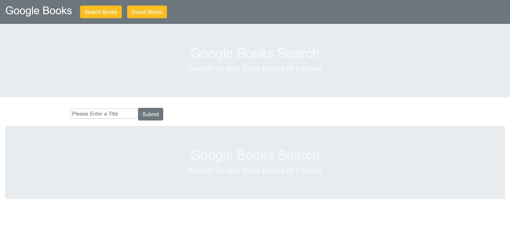

# React Book Search

I created a website a google books search directory. It allows you to be able to search for your favorite books through the book library. When you find the book you are looing for it allows you to save you book of choice to the database so that you can look back later. This application is a full stack mern application, using Mongo, Node, React and Express.

### Screenshots

## Built With

* [HTML](https://developer.mozilla.org/en-US/docs/Web/HTML)
* [CSS](https://developer.mozilla.org/en-US/docs/Web/CSS)
* [Bootstrap](https://getbootstrap.com/)
* [React.js](https://reactjs.org/)
* [Node.js](https://nodejs.org/en/)
* [Express.js](http://expressjs.com/)
* [Mongo](https://www.mongodb.com/)

## Deployed Link

* [See Live Site](https://damp-taiga-22990.herokuapp.com/)

## Author

* **Ryan Nemec** 

- [Link to Portfolio Site](https://perfectoment.github.io/Ryan-Portfolio/index.html)
- [Link to Github](https://github.com/perfectoment)
- [Link to LinkedIn](https://www.linkedin.com/in/ryan-nemec-5a6b3a66/)